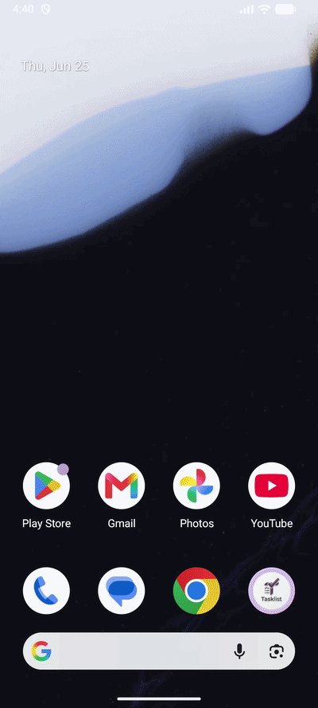
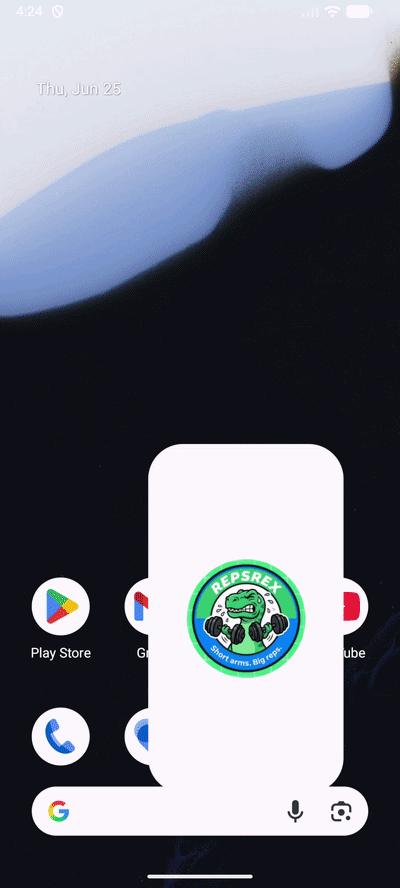
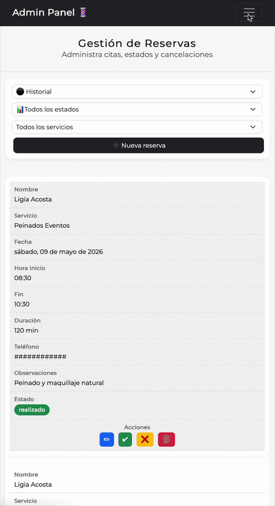

<h2 align="left">Full-Stack & Mobile Developer | iOS · Android · Web</h2>

---

# 🚀 Profile

Software Developer focused on **web and mobile applications**, with experience building production-ready projects and integrating real-world APIs.

Main focus areas:
- Native Android development with Kotlin  
- Native iOS development with Swift  
- Full-stack web development  
- REST API integration  
- Modern UI and user experience  
- Cloud deployment and clean code practices  

💡 Currently growing as a **Mobile & Full-Stack Developer**.

---

# 🧠 Tech Stack

## 📱 Mobile Development
| Platform | Technologies |
|----------|--------------|
| **Android** | Kotlin · Android Studio · Retrofit · Coroutines · Material Design |
| **iOS** | Swift · Xcode · UIKit · MapKit · CoreLocation · MKDirections · async/await · Core Haptics |
| **Cross-Platform** | REST APIs · MVVM · Clean Architecture |

## 🌐 Web & Backend
| Area | Technologies |
|------|--------------|
| Languages | Java · JavaScript · PHP · Python |
| Frontend | HTML · CSS · Bootstrap |
| Backend | Symfony · Laravel · REST APIs |
| Cloud / DevOps | Firebase (Firestore, Auth, Hosting) · Vercel · Cloudflare · Docker · Git · GitHub |
| Databases | MySQL · PostgreSQL · Firebase |
| **Map Services** | MapKit · CoreLocation · MKDirections · Reverse Geocoding · CLGeocoder |

---

# 🏆 Featured Projects

| Project | Preview | Project | Preview |
|:---|:---:|:---|:---:|
| **🛒 AlimentaShop (iOS)** [🔗](https://github.com/GualpaJ/AlimentaShop-iOS)  iOS app to find convenience stores with interactive maps and routing.  **Core:** MapKit · GPS · MKDirections · Firebase Auth |  | **🎬 FindFilms (Android)** [🔗](https://github.com/GualpaJ/FindFilms)  Movie search engine with real-time search, REST API integration, and rich detail view.  **Core:** Retrofit · Coroutines · ListAdapter · Material Design |  |
| **✅ TaskList App (Android)** [🔗](https://github.com/GualpaJ/TaskList-Android)  Complete to-do list manager with Room persistence, MVVM, and search.  **Core:** Room DB · MVVM · Material Design · Coroutines · DiffUtil |  | **🏋️ RepsRex (Android)** [🔗](https://github.com/GualpaJ/RepsRex-Android)  Workout routine manager with 530+ exercises and Room persistence.  **Core:** Room DB · MVVM · Material Design · Coroutines |  |
| **📱 FreeToGame (iOS)** [🔗](https://github.com/GualpaJ/FreeToGame-iOS)  Free games catalog from REST API with interactive gallery.  **Core:** UIKit · async/await · UICollectionView · Core Haptics |  | **🎮 FreeGames (Android)** [🔗](https://github.com/GualpaJ/FreeGames-Android)  Free-to-play games explorer with REST API integration.  **Core:** Retrofit · RecyclerView · Coroutines |  |
| **🏢 Grupo HPPSAP** [🔗](https://www.grupohppsap.com)  Corporate website in production with serverless architecture.  **Core:** Vercel · Serverless · API Integration |  | **💇 Urban Imagen & Spa** [🔗](https://www.urbanimagenstudio.com)  Complete salon management system with booking and admin panel.  **Core:** Firebase · Booking System · Admin CRUD · .ics Generation |  |

---

## 📂 Other Projects

| Project | Description | Stack |
|---------|-------------|-------|
| **Zodiac App** (Android) [🔗](https://github.com/GualpaJ/Zodiac-App-Android) | Zodiac sign listing with search, persistent favorites (SharedPreferences), and share functionality | Kotlin · RecyclerView · SharedPreferences · Material Design |
| **Zodiac-iOS** [🔗](https://github.com/GualpaJ/Zodiac-iOS) | iOS version of zodiac app with detail navigation | Swift · UIKit |
| **IMC Calculator** (Android) [🔗](https://github.com/GualpaJ/IMC-App-Android) | BMI calculator with reactive UI, slider, and real-time visual feedback (colors and messages) | Kotlin · Material Design · CardView |
| **BMI-iOS** [🔗](https://github.com/GualpaJ/BMI-iOS) | iOS version of BMI calculator | Swift · UIKit |
| **FindFilms** [🔗](https://github.com/GualpaJ/FindFilms) | Movie search and explorer with list and detail screens | Kotlin · RecyclerView · REST API |

---

